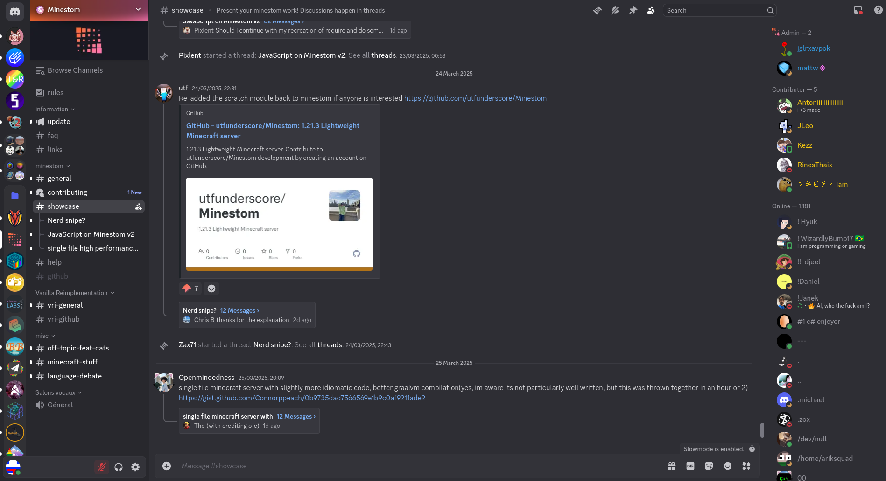

# Discord themes

A selection of some CSS tweaks for the new UI update to make it bearable

## Usage

Put `https://raw.githubusercontent.com/zax71/discord-themes/refs/heads/main/theme.css` under Settings -> Themes -> Online themes in [Vencord](https://vencord.dev/)

## Showcase

## Credits

Barely any of this is my own work!

- nspc911: Typing indicator and similar above chat bar
- surgedevs: Remove title bar
- blackbearftw: Smaller user panel
- voxel: Expand server list to top of viewport
- ukriu: Bring back round server icons
- love_axolotl: DM Upsell removal
